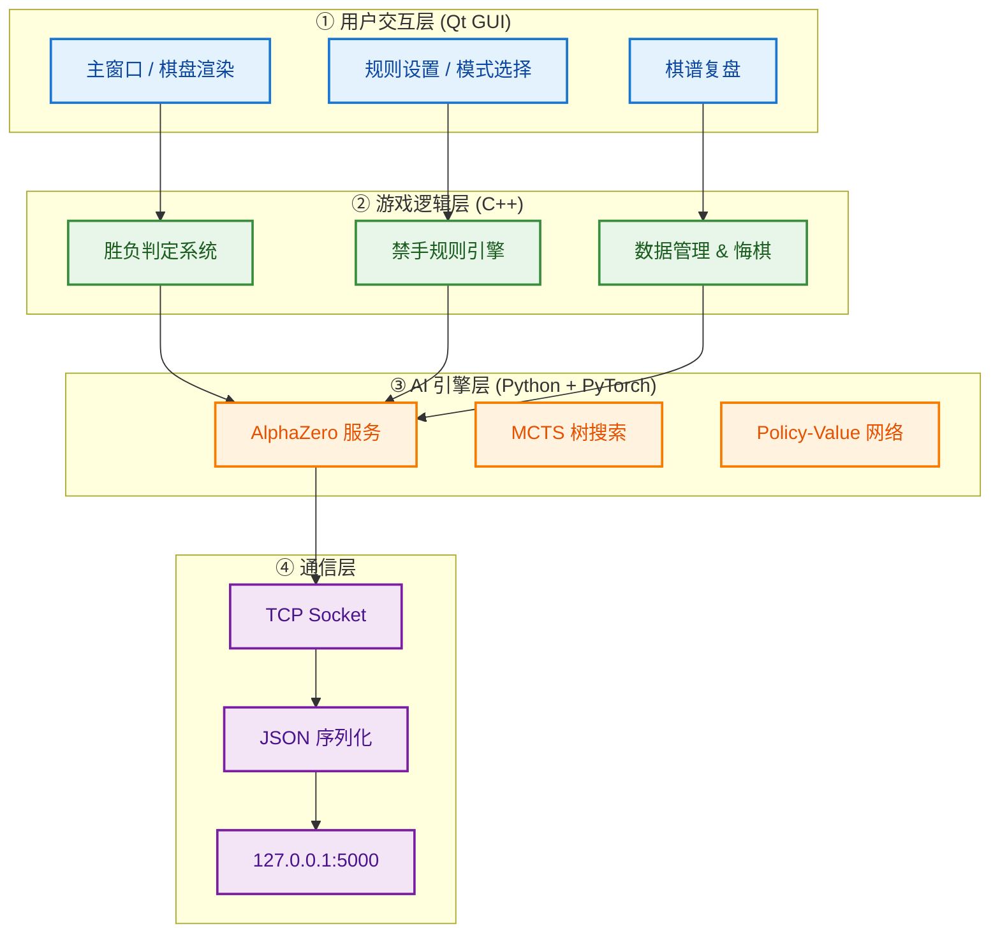
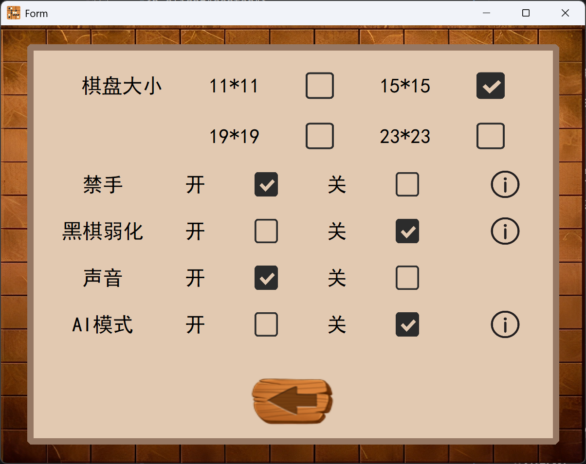
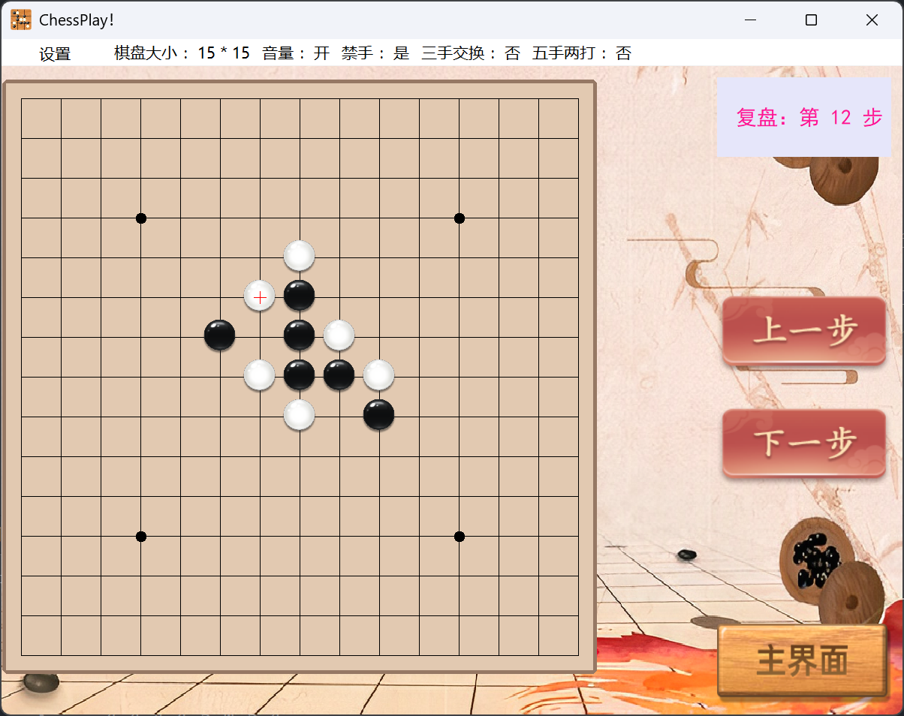

# Chess Play  —— 智能博弈与深度强化学习研究平台

[](https://isocpp.org/)
[](https://www.qt.io/)
[](https://www.python.org/)
[](https://pytorch.org/)
[](LICENSE)

<p align="center">
  
</p>

## 📋 项目简介

**ChessPlay**是一款融合传统启发式算法与深度强化学习的智能五子棋博弈平台。项目包含完整的Qt图形界面客户端和基于AlphaZero架构的AI引擎，支持人机对战、双人对战及专业比赛规则，为五子棋算法研究与娱乐对战提供一站式解决方案。

### 核心能力

| 功能模块 | 技术实现 | 应用场景 |
|---------|---------|---------|
| 🎮 双人对战 | Qt图形界面 + 实时胜负判定 | 本地娱乐对弈 |
| 🤖 传统AI | 启发式评估 + Minimax搜索 | 入门级人机对战 |
| 🧠 AlphaZero AI | ResNet + MCTS + 自对弈训练 | 专业级人机对战 |
| 📜 专业规则 | 禁手/三手交换/五手两打 | 职业比赛模拟 |
| 📊 棋谱复盘 | 完整对局记录与回放 | 棋局分析与学习 |

---

## 🏗️ 系统架构



---

## 🚀 快速开始

### 环境要求

- **操作系统**: Windows 10/11, Linux (Ubuntu 18.04+), macOS 10.15+
- **C++编译器**: MSVC 2019+ / MinGW 8.1+ / GCC 9+
- **Qt框架**: 5.15+ 或 6.x
- **Python**: 3.8 或更高版本
- **CUDA**: 11.1+ (推荐，用于GPU加速AlphaZero推理)

### 安装步骤

#### 1. 克隆仓库

```bash
git clone https://github.com/Shallowind/chess-play-qt-gobang.git
cd chess-play-qt-gobang
```

#### 2. 编译Qt客户端

```bash
# 创建构建目录
mkdir build && cd build

# 配置 (根据您的Qt安装路径调整)
cmake .. -DCMAKE_PREFIX_PATH=/path/to/qt/5.15.2/msvc2019_64

# 编译
cmake --build . --config Release

# 输出: GomokuMaster.exe (Windows) 或 GomokuMaster (Linux/Mac)
```

#### 3. 配置Python环境

```bash
# 创建虚拟环境
conda create -n gomoku python=3.9
conda activate gomoku

# 安装依赖
pip install torch>=1.9.0 torchvision>=0.10.0 numpy>=1.20.0
```

#### 4. 下载预训练模型

```bash
# 创建模型目录
mkdir weights

# 下载最佳策略模型
# 模型文件: best_policy.model (PyTorch状态字典)
# 放置路径: ./weights/best_policy.model
```

#### 5. 运行应用

**方式一: 仅使用传统AI (无需Python)**
```bash
./GomokuMaster
```

**方式二: 使用AlphaZero AI (推荐)**
```bash
# 终端1: 启动AI服务
python alphazero_server.py

# 终端2: 启动客户端
./GomokuMaster
```

---

## 📖 使用指南

### 游戏模式选择

启动后选择游戏模式：

| 模式 | 说明 | AI类型 |
|-----|------|--------|
| **人机对战-执黑** | 玩家先手，AI后手 | 传统AI / AlphaZero |
| **人机对战-执白** | AI先手，玩家后手 | 传统AI / AlphaZero |
| **双人对战** | 本地两位玩家对弈 | 无 |

### 专业规则配置

通过菜单栏或设置界面配置比赛规则：

<p align="center">
  
</p>

| 规则 | 说明 | 默认值 |
|-----|------|--------|
| **禁手规则** | 黑方禁止长连、双三、双四 | 开启 |
| **三手交换** | 第三手后白方可选择交换 | 关闭 |
| **五手两打** | 第五手黑方提供两个打点 | 关闭 |
| **棋盘尺寸** | 支持11/15/19/23路 | 15×15 |

### 核心功能操作

#### 1. 开始对弈

- **落子**: 鼠标左键点击棋盘交叉点
- **悔棋**: 点击"悔棋"按钮 (限人机模式，每人限悔棋2次)
- **提示**: 点击"提示"按钮，AI推荐下一步位置
- **认输**: 点击"认输"结束当前对局

#### 2. 棋谱复盘

对局结束后自动保存棋谱，支持：
- **单步前进/后退**: 查看每一步棋局状态
- **跳转到指定步数**: 快速定位关键手
- **重新对局**: 清空棋盘重新开始

<p align="center">
  
</p>

---

## ⚙️ 技术实现详解

### 传统AI引擎

**文件**: `Op2.cpp`

| 组件 | 算法 | 说明 |
|-----|------|------|
| 棋型评估 | 模式匹配 | 识别活四、冲四、活三、眠三等 |
| 评分系统 | 加权求和 | 基于棋型威胁度计算位置分值 |
| 决策逻辑 | 极大极小 + 随机扰动 | 攻防兼备，避免完全确定性 |

```cpp
// 评估函数核心逻辑 (ChessCon函数)
// 1. 扫描四个方向（横、竖、左斜、右斜）
// 2. 统计连子数量与空位情况
// 3. 根据棋型分配分数（活四>冲四>活三>...）
// 4. 攻防策略选择：max(进攻分, 防守分)
```

### AlphaZero AI引擎

**文件**: `alphazero_server.py`, `mcts_alphaZero.py`

| 组件 | 技术细节 | 参数 |
|-----|---------|------|
| 神经网络 | ResNet-like CNN | 输入: 4×11×11 状态张量 |
| 策略头 | 输出落子概率分布 | 121维Softmax |
| 价值头 | 输出局面评估 [-1, 1] | Tanh激活 |
| MCTS | 异步树搜索 | c_puct=5, n_playout=400 |

**神经网络结构** (`policy_value_net_pytorch.py`):

```
输入层:    4通道 (当前玩家棋子/对手棋子/最后落子/颜色标识)
           ↓
卷积层1:   32 filters, 3×3, ReLU
           ↓
卷积层2:   64 filters, 3×3, ReLU  
           ↓
卷积层3:   128 filters, 3×3, ReLU
           ↓
策略分支:  4 filters, 1×1 → FC → 121 outputs (LogSoftmax)
价值分支:  2 filters, 1×1 → FC(256) → FC(1) (Tanh)
```

---

## 🔧 高级配置

### AlphaZero性能调优

编辑 `alphazero_server.py`:

| 参数 | 说明 | 默认值 | 建议范围 |
|-----|------|--------|---------|
| `n_playout` | MCTS模拟次数 | 400 | 200-2000 |
| `c_puct` | 探索常数 | 5 | 1-10 |
| `BOARD_SIZE` | 棋盘尺寸 | 11 | 11/15 (需重新训练模型) |
| `N_IN_ROW` | 胜利条件 | 5 | 5 (标准五子棋) |

### 训练新模型

```bash
# 启动自对弈训练
python train.py --init-model ./current_policy.model \
                --board-width 11 \
                --board-height 11 \
                --n-in-row 5 \
                --n-playout 500 \
                --batch-size 512 \
                --game-batch-num 25500

# 训练过程自动保存:
# - current_policy.model: 当前训练中的模型
# - best_policy.model:    历史最优模型（基于胜率评估）
```

**训练参数说明** (`train.py`):

| 参数 | 说明 | 默认值 |
|-----|------|--------|
| `learn_rate` | 初始学习率 | 2e-3 |
| `lr_multiplier` | 学习率自适应乘子 | 1.0 (KL自适应) |
| `kl_targ` | KL散度目标值 | 0.02 |
| `buffer_size` | 经验回放缓冲区 | 10000 |
| `epochs` | 每批数据训练轮数 | 5 |

---

## 📊 性能基准

测试环境: Intel i7-12700H + RTX 3060 (Laptop)

| AI类型 | 平均每步耗时 | 棋力评估 | 适用场景 |
|--------|-------------|---------|---------|
| 传统AI (简单) | <10ms | 初级 | 快速对弈 |
| 传统AI (困难) | ~50ms | 中级 | 休闲对战 |
| AlphaZero (400 playouts) | ~500ms | 高级 | 标准对战 |
| AlphaZero (2000 playouts) | ~2.5s | 专业级 | 深度分析 |

---

## 🛠️ 开发指南

### 添加新AI引擎

1. **创建检测文件**: 复制 `detect_yolov5.py` 结构，实现 `run()` 函数
2. **集成到主程序**: 在 `mainwindow.cpp` 的 `luoziAI()` 中添加调用逻辑
3. **更新UI**: 在 `form.cpp` 中添加模式选择按钮

```cpp
// 示例: 在 mainwindow.cpp 中添加新AI调用
void MainWindow::luoziAI(char op) {
    switch(ai_type) {
        case '1': // 传统AI
            traditionalAI(op);
            break;
        case '2': // AlphaZero
            alphaZeroAI(op);  // 通过Socket通信
            break;
        case '3': // 您的新AI
            yourNewAI(op);
            break;
    }
}
```

---

## 🤝 贡献指南

我们欢迎社区贡献！请遵循以下流程：

1. **Fork** 本仓库
2. 创建 **Feature Branch** (`git checkout -b feature/AmazingFeature`)
3. **Commit** 更改 (`git commit -m 'Add some AmazingFeature'`)
4. **Push** 到分支 (`git push origin feature/AmazingFeature`)
5. 创建 **Pull Request**

### 代码规范

**C++部分**:
- 遵循 [Google C++ Style Guide](https://google.github.io/styleguide/cppguide.html)
- 使用 `camelCase` 命名函数，`PascalCase` 命名类
- 头文件使用 `#pragma once` 或 include guard

**Python部分**:
- 遵循 [PEP 8](https://www.python.org/dev/peps/pep-0008/) 编码规范
- 使用类型注解 (`typing` 模块)
- 关键函数添加 Google Style Docstring

---

## 📄 许可证

本项目采用 [MIT License](LICENSE) 开源许可证。

```
MIT License

Copyright (c) 2024 Gomoku Master Team

Permission is hereby granted, free of charge, to any person obtaining a copy
of this software and associated documentation files (the "Software"), to deal
in the Software without restriction, including without limitation the rights
to use, copy, modify, merge, publish, distribute, sublicense, and/or sell
copies of the Software, and to permit persons to whom the Software is
furnished to do so, subject to the following conditions:

The above copyright notice and this permission notice shall be included in all
copies or substantial portions of the Software.
```

---

## 🙏 致谢

本项目基于以下优秀开源项目与研究构建：

- **AlphaZero算法**: [Silver et al., "Mastering the game of Go without human knowledge", Nature 2017](https://www.nature.com/articles/nature24270)
- **AlphaZero_Gomoku**: [junxiaosong/AlphaZero_Gomoku](https://github.com/junxiaosong/AlphaZero_Gomoku) - 基础架构参考
- **PyTorch**: [facebookresearch/pytorch](https://github.com/pytorch/pytorch) - 深度学习框架
- **Qt Project**: [qt/qtbase](https://github.com/qt/qtbase) - GUI框架

